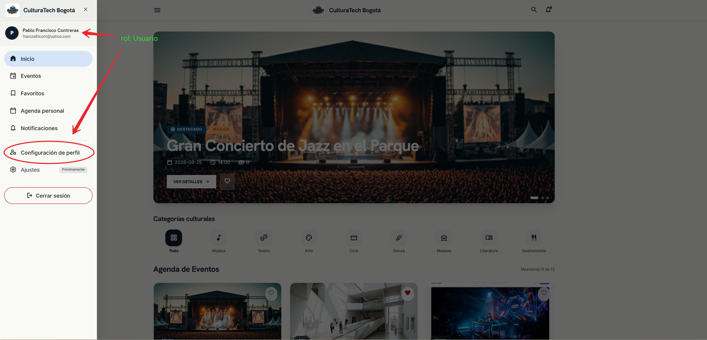
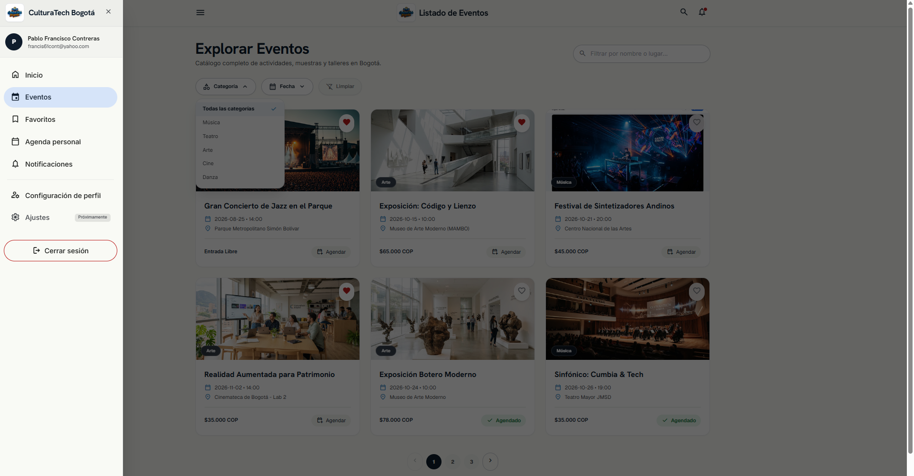
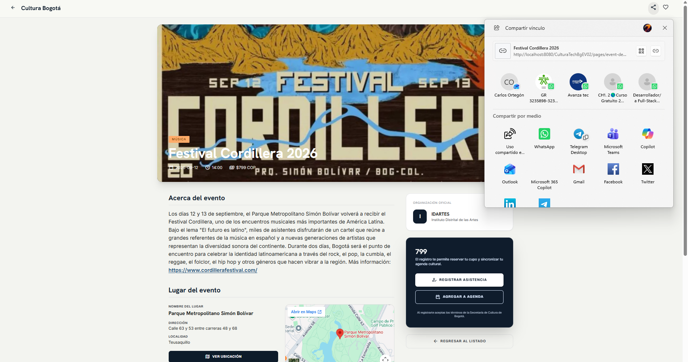
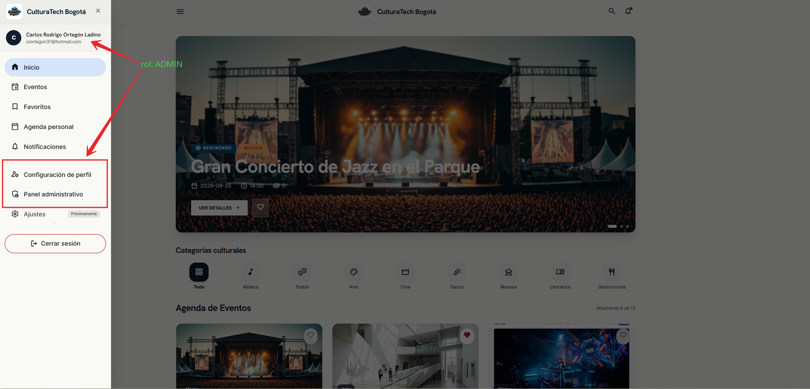
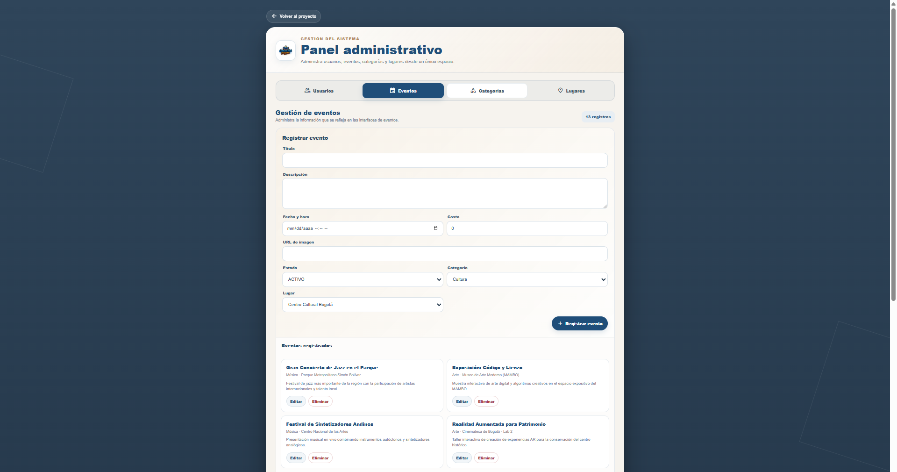

# CulturaTech Bogotá — Codificación de módulos del software stand-alone, web y móvil. AA3-EV01

## Organización del repositorio

Este repositorio contiene los desarrollos correspondientes a la evidencia AA3 - EV01, relacionados con la construcción y el versionamiento de un proyecto web desarrollado con **Java, Spring Boot, Spring Data JPA y MySQL**.

### Estructura de ramas

| Rama     | Uso                                                                                                                          |
|----------|------------------------------------------------------------------------------------------------------------------------------|
| `master` | Rama base y libre del repositorio. Se conserva como referencia inicial y no se utiliza para el desarrollo de las evidencias. |
| `main`   | Rama utilizada para el desarrollo correspondiente a **AA3 - EV01**, incluyendo el proyecto **CulturaTechBg-EV01**.           |

---

## 1. Descripción del proyecto

CulturaTech Bogotá es una aplicación web desarrollada para gestionar información relacionada con usuarios, eventos, categorías y lugares. Para esta evidencia se implementó el módulo web utilizando **Java**, **Spring Boot** para la construcción de la aplicación, **Spring Data JPA** para la gestión de la persistencia de datos, **Hibernate** como implementación de ORM y **MySQL** como sistema gestor de base de datos con una interfaz estática HTML, CSS y JavaScript.

La aplicación utiliza controladores REST para exponer las operaciones del sistema y repositorios basados en `JpaRepository` para el acceso a los datos.

La estructura principal del código se encuentra organizada en:

```text
src/
└── main/
    ├── java/com/culturatech/culturatechev01/
    │   ├── controller/
    │   ├── model/
    │   ├── repository/
    │   └── util/
    └── resources/
        ├── static/
        │   ├── assets/
        │   ├── css/
        │   ├── js/
        │   └── *.html
        └── application.properties
```

También se incluye el script de base de datos en:

```text
database/culturatechbg-ev01.sql
```

y el script utilizado para asignar el rol administrativo en:

```text
database/crear_administrador.sql
```

---

## 2. ¿Cómo ejecutar el proyecto?

### 2.1 Preparar la base de datos

1. Tener disponible una instalación de MySQL.
2. Ejecutar el script:

```text
database/culturatechbg-ev01.sql
```

3. Verificar que exista la base de datos:

```text
culturatechbg
```

4. Revisar la configuración de conexión en:

```text
src/main/resources/application.properties
```

> No publicar en GitHub contraseñas reales, credenciales personales ni otros datos sensibles. Cada desarrollador debe configurar sus credenciales locales.

### 2.2 Ejecutar la aplicación

Desde NetBeans, abrir el proyecto Maven y ejecutar la clase principal:

```text
CulturatechEv01Application.java
```

También puede utilizarse el Maven Wrapper incluido en el proyecto.

Cuando la aplicación esté ejecutándose, acceder desde el navegador a la dirección local configurada por Spring Boot.

---

## 3. Uso de `crear_administrador.sql`

El archivo `database/crear_administrador.sql` **no crea un usuario desde cero**. Su función es convertir en administrador (`ADMIN`) a un usuario que ya se encuentra registrado en la tabla `usuario`.

El archivo contiene tres acciones principales:

```sql
USE culturatechbg;

UPDATE usuario
SET rol = 'ADMIN'
WHERE correo = 'CORREO_DEL_ADMIN_AQUI';

SELECT id_usuario, nombres, apellidos, correo, rol
FROM usuario
WHERE correo = 'CORREO_DEL_ADMIN_AQUI';
```

### Paso a paso

**Paso 1. Registrar el usuario**

Primero se registra normalmente el usuario desde la aplicación CulturaTech Bogotá utilizando el formulario de registro.

**Paso 2. Identificar el correo**

Se toma exactamente el correo utilizado durante el registro.

**Paso 3. Abrir el script**

Desde el proyecto abrir:

```text
database/crear_administrador.sql
```

**Paso 4. Reemplazar el marcador**

Cambiar:

```sql
'CORREO_DEL_ADMIN_AQUI'
```

por el correo real del usuario que se desea convertir en administrador.

Ejemplo:

```sql
UPDATE usuario
SET rol = 'ADMIN'
WHERE correo = 'admin@ejemplo.com';
```

**Paso 5. Ejecutar el `UPDATE`**

Ejecutar la sentencia en MySQL sobre la base de datos `culturatechbg`.

**Paso 6. Verificar el resultado**

Ejecutar la consulta `SELECT` incluida en el mismo archivo y comprobar que el campo `rol` aparezca como:

```text
ADMIN
```

**Paso 7. Probar el acceso**

Ingresar nuevamente a la aplicación con las credenciales del usuario y verificar el comportamiento correspondiente al rol administrativo.

> El script debe ejecutarse sobre el usuario previamente registrado. El correo utilizado en el `UPDATE` debe coincidir con el registro existente en la base de datos.


---

## 4. Tecnologías utilizadas

El proyecto CulturaTech Bogotá está desarrollado con Java y Spring Boot, utilizando una arquitectura web basada en controladores REST, repositorios y entidades persistentes.

Las principales tecnologías utilizadas son:

- **Java 21:** lenguaje utilizado para el desarrollo de la aplicación.
- **Spring Boot 4.1.1:** framework utilizado como base para la construcción, configuración y ejecución de la aplicación.
- **Spring Data JPA:** tecnología utilizada para facilitar el acceso y la persistencia de los datos mediante repositorios.
- **JPA (Jakarta Persistence):** especificación utilizada para realizar el mapeo entre las clases Java y las tablas de la base de datos.
- **Hibernate:** proveedor ORM utilizado para implementar la persistencia definida mediante JPA. Hibernate se encarga de gestionar el mapeo      objeto-relacional y la interacción de las entidades Java con la base de datos.
- **MySQL:** sistema gestor de base de datos utilizado para almacenar la información del proyecto.
- **Spring Web MVC:** componente utilizado para construir los controladores REST y atender las solicitudes HTTP.
- **Maven:** herramienta utilizada para administrar las dependencias, compilación y construcción del proyecto.
- **HTML, CSS y JavaScript:** tecnologías utilizadas para construir e integrar la interfaz web.
- **Git:** herramienta prevista para el control de versiones del proyecto.

Esta integración permite que el proyecto trabaje con objetos **Java** como `Evento`, `Usuario`, `Categoria` y `Lugar`, mientras **Hibernate** gestiona su correspondencia con las estructuras de la base de datos.

Las dependencias principales del proyecto se encuentran definidas en `pom.xml`.

### Relación entre las tecnologías de persistencia

La persistencia de CulturaTech Bogotá puede entenderse mediante la siguiente relación:

```text
Aplicación CulturaTech Bogotá
            │
            ▼
       Spring Boot
            │
            ▼
    Spring Data JPA
            │
            ▼
   Jakarta Persistence (JPA)
            │
            ▼
        Hibernate
            │
            ▼
          MySQL
```

### 4.1 Evidencia en el código

La utilización de JPA se puede observar directamente en las entidades del proyecto. Por ejemplo, la clase Evento utiliza anotaciones de Jakarta Persistence:

```java
import jakarta.persistence.Entity;
import jakarta.persistence.Table;
import jakarta.persistence.Column;
import jakarta.persistence.GeneratedValue;
import jakarta.persistence.GenerationType;
import jakarta.persistence.Id;
import jakarta.persistence.JoinColumn;
import jakarta.persistence.ManyToOne;

@Entity
@Table(name = "evento")
public class Evento {
```

El identificador de la entidad se define mediante:

```java
@Id
@GeneratedValue(strategy = GenerationType.IDENTITY)
@Column(name = "id_evento")
private Integer idEvento;
```

También se establecen relaciones entre entidades mediante **JPA**. En `Evento`, por ejemplo, se define una relación `ManyToOne` con `Categoria`:

```java
@ManyToOne
@JoinColumn(name = "id_categoria", nullable = false)
private Categoria categoria;
```

y otra relación `ManyToOne` con `Lugar`:

```java
@ManyToOne
@JoinColumn(name = "id_lugar", nullable = false)
private Lugar lugar;
```
Estas anotaciones permiten que la estructura de las clases Java represente las relaciones existentes en la base de datos.

---

## 5. Implementación de operaciones CRUD

El proyecto utiliza controladores REST y repositorios Spring Data JPA para implementar las operaciones de persistencia.

Como ejemplo, el repositorio de eventos extiende `JpaRepository`:

```java
public interface EventoRepository extends JpaRepository<Evento, Integer> {

}
```

Esto permite utilizar las operaciones de persistencia proporcionadas por Spring Data JPA.

El controlador de eventos expone las operaciones principales mediante endpoints REST:

```java
@RestController
@RequestMapping("/api/eventos")
public class EventoController {

    private final EventoRepository eventoRepository;

    public EventoController(EventoRepository eventoRepository) {
        this.eventoRepository = eventoRepository;
    }

    @GetMapping
    public List<Evento> listar() {
        return eventoRepository.findAll();
    }

    @GetMapping("/{id}")
    public Evento buscar(@PathVariable Integer id) {
        return eventoRepository.findById(id).orElse(null);
    }

    @PostMapping
    public Evento crear(@RequestBody Evento evento) {
        return eventoRepository.save(evento);
    }

    @PutMapping("/{id}")
    public Evento actualizar(@PathVariable Integer id, @RequestBody Evento evento) {
        evento.setIdEvento(id);
        return eventoRepository.save(evento);
    }

    @DeleteMapping("/{id}")
    public void eliminar(@PathVariable Integer id) {
        eventoRepository.deleteById(id);
    }
}
```

En este controlador se evidencian las operaciones:

- `GET`: consulta de registros.
- `POST`: creación de registros.
- `PUT`: actualización de registros.
- `DELETE`: eliminación de registros.

La misma estructura se aplica en los controladores correspondientes a usuarios y categorías, y el proyecto también contiene el controlador de lugares.

---

## 6. Integración de la interfaz con el backend

La interfaz web utiliza JavaScript para comunicarse con los endpoints de Spring Boot mediante solicitudes HTTP.

Por ejemplo, el panel administrativo consulta los usuarios mediante:

```javascript
const response = await fetch('/api/usuarios');
const usuarios = await response.json();
```

Para guardar un usuario, el código determina si corresponde a una creación o actualización y envía los datos a la API:

```javascript
const method = id ? 'PUT' : 'POST';
const url = id
    ? `/api/usuarios/${id}`
    : '/api/usuarios';

const response = await fetch(url, {
    method: method,
    headers: {
        'Content-Type': 'application/json'
    },
    body: JSON.stringify(usuario)
});
```

Este mecanismo conecta los formularios de la interfaz con los controladores REST del proyecto.

---

## 7. Comentarios y organización del código

El código fuente contiene comentarios y documentación en las clases, métodos y procesos principales. Estos comentarios permiten identificar la responsabilidad de los controladores, repositorios y funciones JavaScript.

Ejemplo:

```java
/**
 * Controlador REST del módulo de eventos.
 * Permite gestionar las operaciones CRUD mediante Spring Boot.
 */
```

También se utilizan nombres descriptivos para clases, métodos y variables, manteniendo la separación entre controladores, modelos, repositorios y utilidades.

---

## 8. Evidencias visuales de los roles

Las siguientes imágenes hacen parte de los recursos del proyecto y permiten documentar el funcionamiento de las interfaces correspondientes a usuario y administrador.

### Rol usuario

#### Acceso del usuario



#### Página principal del usuario


#### Eventos disponibles para el usuario



#### Detalle de evento



### Rol ADMIN

#### Acceso administrativo



#### Panel de eventos



#### Formulario administrativo


#### Edición de información


#### Eliminación de registros


---

## 9. Ubicación de las imágenes

Las imágenes utilizadas por este README se encuentran dentro del mismo proyecto, por lo que los enlaces utilizan rutas relativas:

```text
src/main/resources/static/assets/images/README/
```

Esto permite que las imágenes se mantengan disponibles tanto en el proyecto local como en el repositorio de GitHub, siempre que se conserve la estructura de carpetas.

---

## 10. Evidencia del cumplimiento de AA3-EV01

La implementación presentada para esta evidencia contiene los elementos técnicos desarrollados para el módulo web de CulturaTech Bogotá:

- Proyecto Java administrado con Maven.
- Aplicación basada en Spring Boot.
- Persistencia mediante Jakarta Persistence (JPA), utilizando Spring Data JPA y Hibernate como proveedor ORM, con MySQL como sistema gestor de base de datos.
- Entidades/modelos, repositorios y controladores REST.
- Operaciones CRUD para los módulos implementados.
- Interfaz web integrada con los endpoints mediante JavaScript.
- Comentarios dentro del código fuente.
- Organización del proyecto por responsabilidades.
- Script de base de datos incluido en el proyecto.
- Script independiente para asignar el rol `ADMIN` a un usuario existente.
- Evidencias visuales de los roles `usuario` y `ADMIN`.
- Archivos preparados para control de versiones mediante Git.

La documentación y el código de esta evidencia deben conservar la misma estructura y nombres definidos en el proyecto entregado.

---

## 11. Control de versiones

El proyecto está preparado para ser gestionado mediante Git. Antes de realizar la publicación definitiva en GitHub se debe comprobar que:

1. El nombre del autor y los datos académicos del README hayan sido completados.
2. No existan contraseñas, credenciales o información sensible dentro de los archivos que serán publicados.
3. El archivo `.gitignore` sea respetado durante la creación del repositorio.
4. El README y las imágenes se encuentren incluidos en el proyecto.
5. El repositorio contenga el código fuente y los archivos necesarios para ejecutar y revisar la evidencia.

---


## 12. Autoría

**Autor:** Carlos Rodrigo Ortegón
**Correo:** crortegon37@hotmail.com  
**Ficha SENA:** ADSO-3235898  
**Proyecto:** CulturaTech Bogotá  
**Evidencia:** AA3-EV01
**Año:** 2026